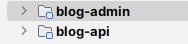
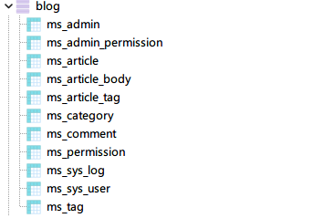
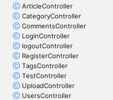

# blog-parent
## 一、简介

个人博客系统，包括博客展示系统和后台管理系统，展示系统中，用户可以查看发布的文章，也可以注册登陆后自己发布文章，在别人的文章下评论，可以根据标签、分类和时间线查看文章。后台管理系统则是可以查询管理系统注册的用户，发布的文章，文章分类，标签等。



blog-admin项目是博客后台管理系统

blog-api项目是是博客系统的后端

技术：

​	前后端分离构造

​	后端: springboot、elasticsearch、redis、mysql、canal

​	前端：vue、vuex

​	微服务部署：docker

描述：前端采用vue编写，后端使用springboot编写，数据使用mysql存储，redis存储前端发送的请求与结果用于提升访问速度，使用elasticsearch实现文章的查询功能，使用canal实现mysql与elasticsearch之间的数据同步。mysql、elasticsearch、canal服务使用docker部署。

## 二、数据库描述

​	数据库包括如下表：



ms_admin表：后台管理系统用户，即管理员

ms_admin_permission表：后台管理员权限管理

ms_permssion表：后台用户可以拥有的权限

ms_article表：存储文章信息

ms_article_body表：存储文章正文

ms_article_tag表：存储文章包含的标签，一个分章可以包含多个标签

ms_category表：分类

ms_tag表：标签

ms_comment表：文章的评论

ms_sys_log表：用户日志，目前还没有实现

ms_sys_user表：用户表

## 三、后端结构



ArticleController:查询所有文章，根据分类查询文章、根据标签查询文章、根据时间查询文章、根据关键词搜索文章，查询热门文章，查询最新文章，发布文章、修改文章、删除文章

CategoryController: 查询所有分类、查询具体分类的信息、查询分类下包含的文章

CommensController:获取文章评论、发布评论

LoginController:用户登录

logoutController:用户退出登录

RegisterController:用户注册

TagsController:获取所有标签、获取具体标签信息、获取标签下的文章、获取热门标签

TestController:测试用的

UploadController:图片、头像存储在云服务器上，该类统一处理，上传图片、获取图片

UserController:获取当前用户新、修改用户信息、修改用户密码

## 四、服务部署

开发时，把各种服务部署在cenyos7服务器上，使用docker部署mysql、elasticsearch、canal、canal-adapter


## 五、参数配置

blog-api:

```yaml
server:
  port: 8088 #端口
spring:
  application:
    name: happyfire-blog #项目名称
  datasource:
    url: #数据库url
    driver-class-name: com.mysql.cj.jdbc.Driver
    username:   #账户
    password:  #密码
  redis:
    host: localhost #redis服务地址
    port: 6379 #redis端口号
  servlet:
    multipart:  #设置上传文件，主要是图片的大小限制
      max-request-size: 20MB
      max-file-size: 2MB
mybatis-plus:
  configuration:
    log-impl: org.apache.ibatis.logging.stdout.StdOutImpl
  global-config:
    db-config:
      table-prefix: ms_  #数据库前缀
  mapper-locations: classpath:org.happyfire.blog.dao.mapper/*.xml

qiniu: #存储图片的云服务器，我采用的七牛云 ，使用了官方提供的工具类 下面是我的key 这部分可以自己更改设置
  accessKey: 
  accessSecretKey: 
```

blog-admin:

```yaml
server:
  port: 8089 #端口
spring:
  application:
    name: happyfire-blog-admin #项目名称
  datasource:
    url: #数据库url
    driver-class-name: com.mysql.cj.jdbc.Driver
    username: #账户
    password: #密码
  redis:
    host: localhost #redis服务地址
    port: 6379 #redis端口号
  servlet:
    multipart: #设置上传文件，主要是图片的大小限制
      max-request-size: 20MB
      max-file-size: 2MB
mybatis-plus:
  configuration:
    log-impl: org.apache.ibatis.logging.stdout.StdOutImpl
  global-config:
    db-config:
      table-prefix: ms_  #数据库前缀
  mapper-locations: classpath:org.happyfire.blog.dao.mapper/*.xml

qiniu: #存储图片的云服务器，我采用的七牛云 ，使用了官方提供的工具类 下面是我的key 这部分可以自己更改设置
  accessKey: 
  accessSecretKey: 
```
